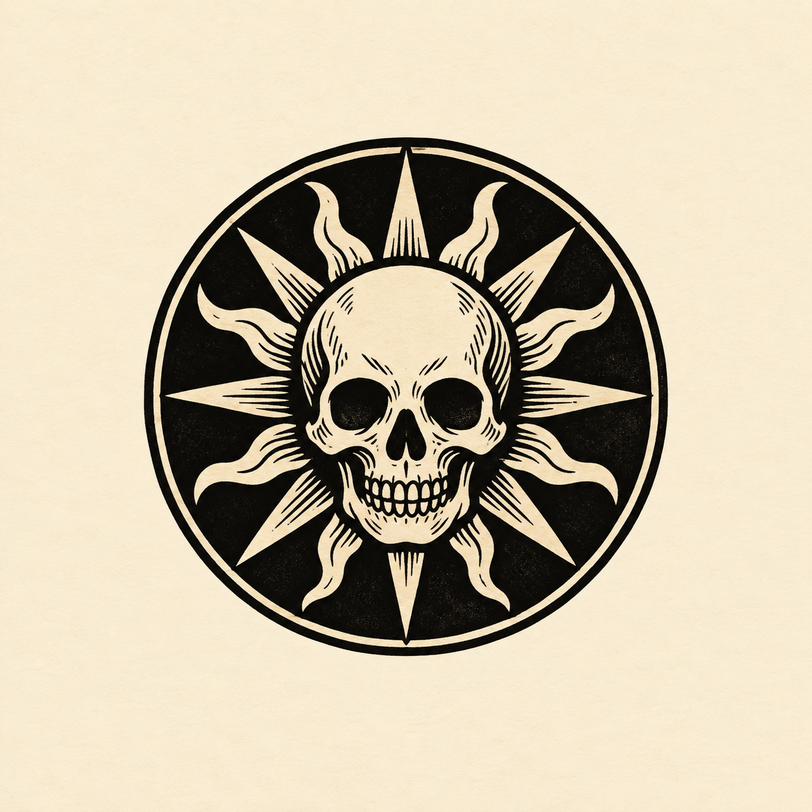
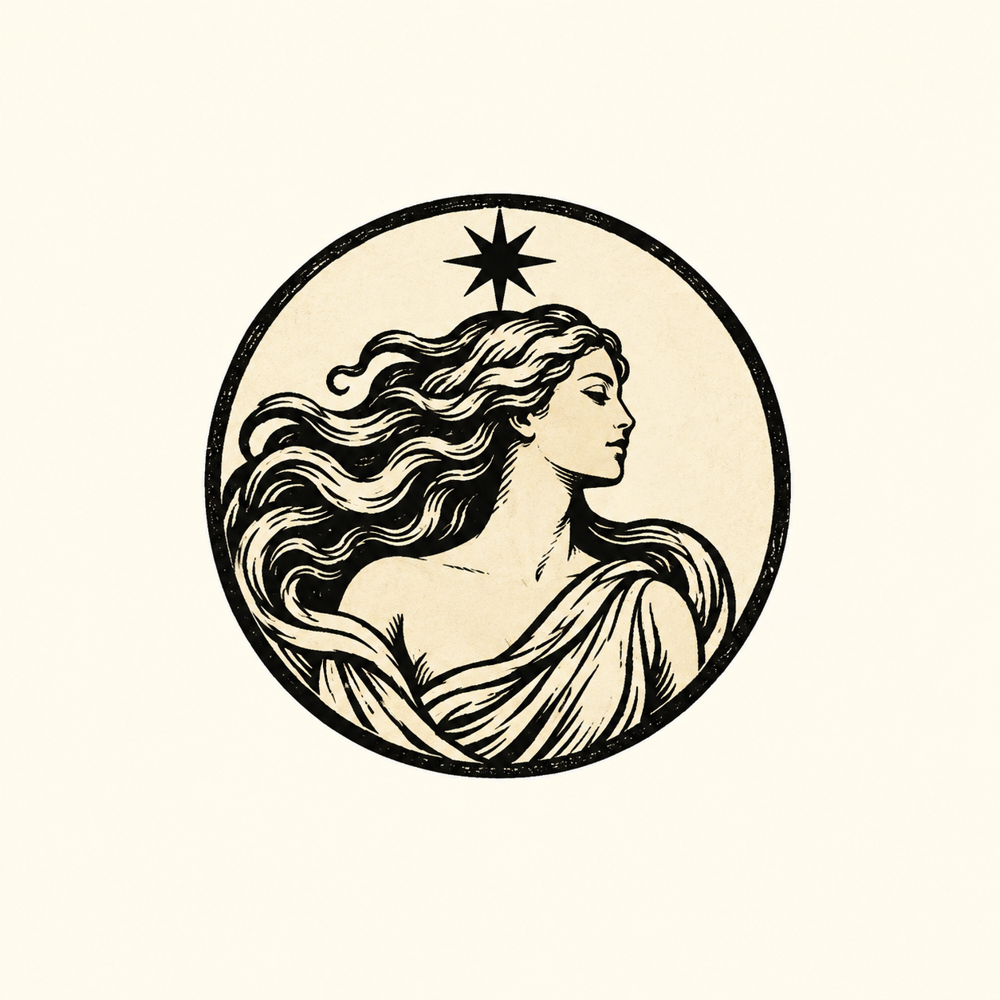

# Akira — two circular tarot logo drafts

Generated with built-in image_gen. The user's latest correction replaces the five elaborate tarot-card explorations with two small circular logo concepts: a skull with the sun around it, and a woman in a classical tarot aesthetic. The egg remains an earlier contender. These are draft artwork for selection; no application assets or labels were changed.

The source PNGs are enlarged concept previews. Fine engraved details will need simplification for a final small icon.

## 1. Sun skull



Reference images (style/subject guidance, not edit targets):

- C:/Users/rose4/Downloads/download (1).jpg
- C:/Users/rose4/Downloads/download.jpg

Exact prompt:

```text
Use case: logo-brand.
Create ONE very small, simple CIRCULAR logo draft for Akira: a frontal skull with sun rays around it, inspired by the skull-and-sun on the staff in reference 1. Reference 2 supplies classical tarot ink style only.
A compact round sun medallion with a bold ivory skull at the center, black eye sockets and a simple jaw. Short alternating straight and gently wavy sun rays radiate around the skull, all contained in a circular silhouette. Black ink and warm parchment only. Classical tarot woodcut character with very sparse engraved accents; strong clean shapes legible at 48–64 pixels.
One centered circular mark, occupying about half of a square plain ivory canvas. No card, rectangular border, title, lettering, numbers, scenery, body, decorative extras, or mockup. This is a tiny logo, not a detailed illustration.
```

## 2. Tarot woman



Reference images (style/subject guidance, not edit targets):

- C:/Users/rose4/Downloads/𖤐 The World - Tarot Cards.jpg
- C:/Users/rose4/Downloads/Tarot_ The Star.jpg
- C:/Users/rose4/Downloads/Time, Senkai Yami.jpg

Exact prompt:

```text
Use case: logo-brand.
Create ONE very small, simple CIRCULAR logo draft for Akira: a graceful adult woman in a classical tarot aesthetic, inspired by the women and engraved linework in the three reference cards.
Reduce her to an elegant waist-up profile with flowing hair and a simply draped classical garment. A single small eight-pointed star above her head, within the circle. Her hair and drapery curve naturally into the round composition. Serene, old-world and slightly mysterious. Black ink and warm parchment only. Bold vintage woodcut shapes and only a few engraved lines; recognizable as a woman at 48–64 pixels.
One centered circular mark, occupying about half of a square plain ivory canvas. No tarot card, rectangular border, title, lettering, numbers, scenery, elaborate frame, additional symbols, or mockup. This is a tiny logo, not a detailed illustration.
```

