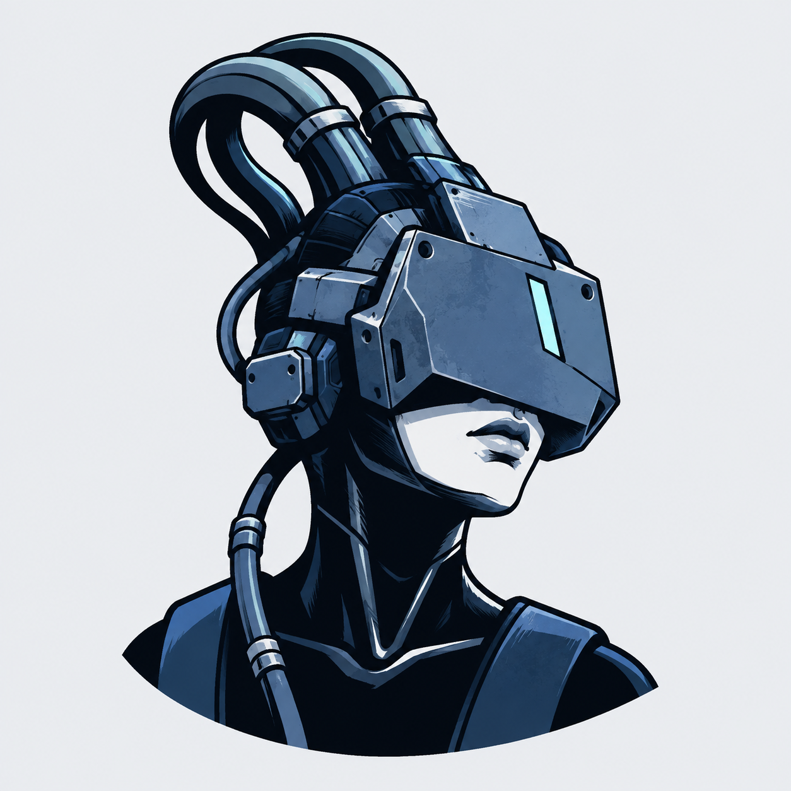
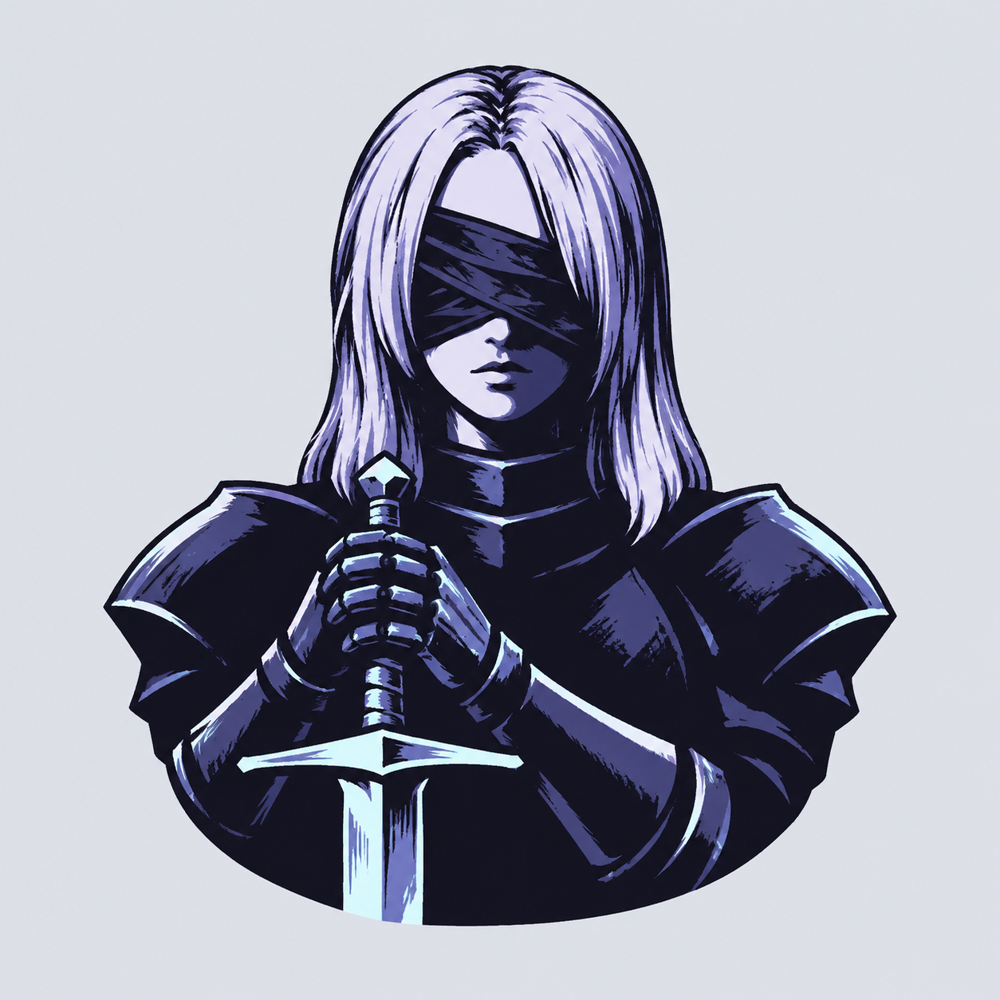
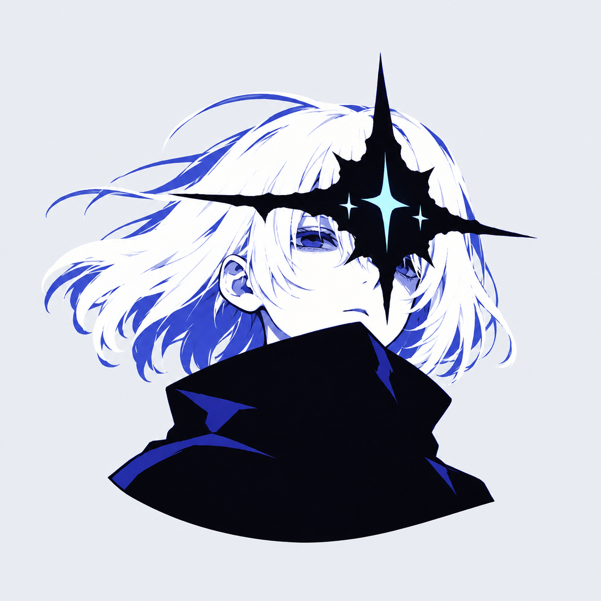

# Akira — cool-color portrait icon concepts

The user liked the preceding full-body tarot concepts, especially the knight, and provided three new references. This pass produces three icons, one per reference: an industrial wired visor, a blindfolded knight, and a celestial face-mask. The requested direction is cool colors, strong contrast, and small icon format, with no pixel art.

Generated using built-in image_gen. References guide subject and drawing style; the supplied artwork files remain unchanged. All three outputs were visually inspected. The compact busts emphasize large mask, face and hair shapes over full-body details. These are concept PNGs with pale presentation backgrounds, not final transparent application icons. Actual 16/32/48-pixel checks and any required simplification remain for the selected direction.

## Wired Visor



Input references:

- `C:/Users/rose4/Downloads/Cyberpunk.jpg`

Exact prompt:

```text
Use case: logo-brand.
Create ONE carefully designed small Akira logo icon inspired closely by the supplied reference's visual language and main subject. Original drawing, not a photograph or a reproduced illustration.
Use a compact HEAD-AND-SHOULDERS / short bust composition so the defining face covering and silhouette read at 48–96 pixels. One dominant shape, only a few secondary shapes, clear separation between light and dark. Crisp graphic ink illustration with confidently drawn curves, NOT pixel art. Simplify small details substantially while retaining the reference's mood.
Deliver a single freestanding centered emblem on a SQUARE uniform very pale cool-gray canvas. Emblem about 65% of the canvas width with generous margins, all silhouette tips fully visible. Strongly contrasting COOL COLORS only, deep near-black shadows and luminous pale highlights, limited coherent palette. Saturation and solid shapes create the light, not blurry glow.
No text, lettering, labels, numbers, signatures, card frame, circular badge, extra symbols floating around, scenery, photorealism, 3D render, busy background, tiny hatching or decorative clutter. This must be a memorable LOGO with the impact of the reference, not a large illustration squeezed down.

Reference role: preserve the industrial manga/ink aesthetic of the large hard-edged rectangular face visor, bundled cables, exposed lower face, and dark high-neck clothing.
Create an adult feminine cyborg bust turned slightly to the right, chin subtly lifted. A large angular slate-blue visor hides the eyes and upper face. Give it two or three strong bevel planes and ONE small icy cyan light inset; omit lettering, stickers, smiley faces, and tiny hardware. A pale lower lip and chin are visible below the visor, framed by near-black neck armor. Three thick cable bundles rise from behind the head and bend together into a compact curved crest, never leaving the icon boundary. One short hanging cable follows a shoulder. Reduce the black jacket to two bold panels.
Palette: blue-black, deep cobalt, cool steel-blue, sharply contrasting icy cyan and near-white skin accents. Keep metal shapes mostly matte and graphic with a bright cyan edge cutting through the dark visor. The faceplate and compact cable crest should be distinctive at a glance. No cigarette or smoke. Slightly rough confident ink contours, restrained technological detail, mysterious and intelligent. No full body.
```

## Blindfolded Knight



Input references:

- `C:/Users/rose4/Downloads/download (4).jpg`

Exact prompt:

```text
Use case: logo-brand.
Create ONE carefully designed small Akira logo icon inspired closely by the supplied reference's visual language and main subject. Original drawing, not a photograph or a reproduced illustration.
Use a compact HEAD-AND-SHOULDERS / short bust composition so the defining face covering and silhouette read at 48–96 pixels. One dominant shape, only a few secondary shapes, clear separation between light and dark. Crisp graphic ink illustration with confidently drawn curves, NOT pixel art. Simplify small details substantially while retaining the reference's mood.
Deliver a single freestanding centered emblem on a SQUARE uniform very pale cool-gray canvas. Emblem about 65% of the canvas width with generous margins, all silhouette tips fully visible. Strongly contrasting COOL COLORS only, deep near-black shadows and luminous pale highlights, limited coherent palette. Saturation and solid shapes create the light, not blurry glow.
No text, lettering, labels, numbers, signatures, card frame, circular badge, extra symbols floating around, scenery, photorealism, 3D render, busy background, tiny hatching or decorative clutter. This must be a memorable LOGO with the impact of the reference, not a large illustration squeezed down.

Reference role: closely retain the stoic blindfolded woman knight, straight shoulder-length hair, dark armor, and two hands resting on a sword, translated into a compact original logo.
Frontal adult woman knight in a calm watchful pose. An angular dark folded blindfold covers BOTH eyes. Smooth pale-lavender hair falls in two broad locks around the blindfold and pale lower face. Dark compact pauldrons and a near-black breastplate create strong shoulders. Both gauntleted hands rest together on the pommel of a vertical sword in front of her torso, slightly off-center so the sword does not hide the face. Only a short section of the blade belongs to the bust, ending neatly with the lower silhouette; no tall full-body sword. Remove intricate chest insignia and chainmail pattern; suggest armor using a few large angular cuts.
Palette: midnight indigo, cold violet, muted periwinkle, with very bright glacier-cyan highlights on the sword and armor edges, pale lavender-white hair and lower face. Deep black blindfold, controlled flat colors, severe contrast. Keep the somber printed/engraved energy of the reference without mottled poster background, tiny textures or all-over scratches. Elegantly ominous. Head and shoulders stay dominant, hands and sword are secondary readable forms. No crown, halo or wings.
```

## Celestial Mask



Input references:

- `C:/Users/rose4/Downloads/download (3).jpg`

Exact prompt:

```text
Use case: logo-brand.
Create ONE carefully designed small Akira logo icon inspired closely by the supplied reference's visual language and main subject. Original drawing, not a photograph or a reproduced illustration.
Use a compact HEAD-AND-SHOULDERS / short bust composition so the defining face covering and silhouette read at 48–96 pixels. One dominant shape, only a few secondary shapes, clear separation between light and dark. Crisp graphic ink illustration with confidently drawn curves, NOT pixel art. Simplify small details substantially while retaining the reference's mood.
Deliver a single freestanding centered emblem on a SQUARE uniform very pale cool-gray canvas. Emblem about 65% of the canvas width with generous margins, all silhouette tips fully visible. Strongly contrasting COOL COLORS only, deep near-black shadows and luminous pale highlights, limited coherent palette. Saturation and solid shapes create the light, not blurry glow.
No text, lettering, labels, numbers, signatures, card frame, circular badge, extra symbols floating around, scenery, photorealism, 3D render, busy background, tiny hatching or decorative clutter. This must be a memorable LOGO with the impact of the reference, not a large illustration squeezed down.

Reference role: capture the high-contrast graphic manga aesthetic, short pale wind-blown hair, strange black pointed celestial face-mask, and broad dark high collar.
An adult woman in slight three-quarter view, with a compact wind-swept white bob and a raised near-black coat collar. A BLACK STAR-LIKE MASK is attached directly across her upper face: irregular long horizontal points, a tall tapered upper point and shorter lower point form an uncanny sharp silhouette. Keep the mask compact enough to remain within a square icon, not a huge horizontal spike. Within the black mask, one bright cyan four-point star is cut out as negative space, plus only two tiny pale marks. The mask is a physical mysterious face covering, not a floating star in the sky. A tiny portion of her pale lower face remains visible above the collar; her identity should feel hidden and enigmatic.
Palette: saturated ultramarine, deep violet-blue, ink black, brilliant frosty cyan and cool near-white hair. Use the blue on a few boldly separated hair-shadow and coat planes. Her pale hair, black star-mask and wide dark collar should create three immediate contrasting shapes. Airy hair sweeps left in only two or three decisive strokes. Sophisticated graphic print/manga sensibility, eerie celestial quiet. No sky, clouds, scattered stars, jewelry, circle or frame. No full body.
```

## Notes for Claude

- Current medium: non-pixel graphic illustration with cool colors and strong light/dark contrast.
- The user approved the prior three black-and-white tarot ideas for continued exploration, especially the star-masked angel knight. Preserve them.
- The gothic statue direction is abandoned; its older assets remain only as history.
- The circle-and-detached-star badge remains superseded. Celestial mask imagery is intentionally retained as part of the face covering.
- No final logo was selected or installed in this pass. Runtime labels, UI code and backend code were untouched.
- The current three images and the preceding three tarot images are saved under docs/branding, with exact prompts in this file and fullbody-tarot-prompts.md.

