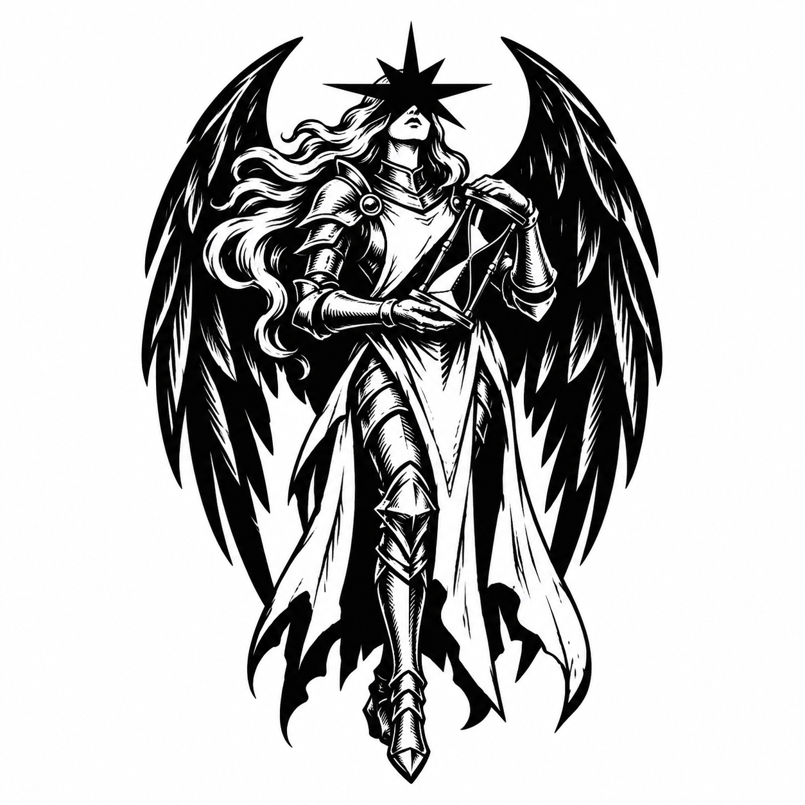
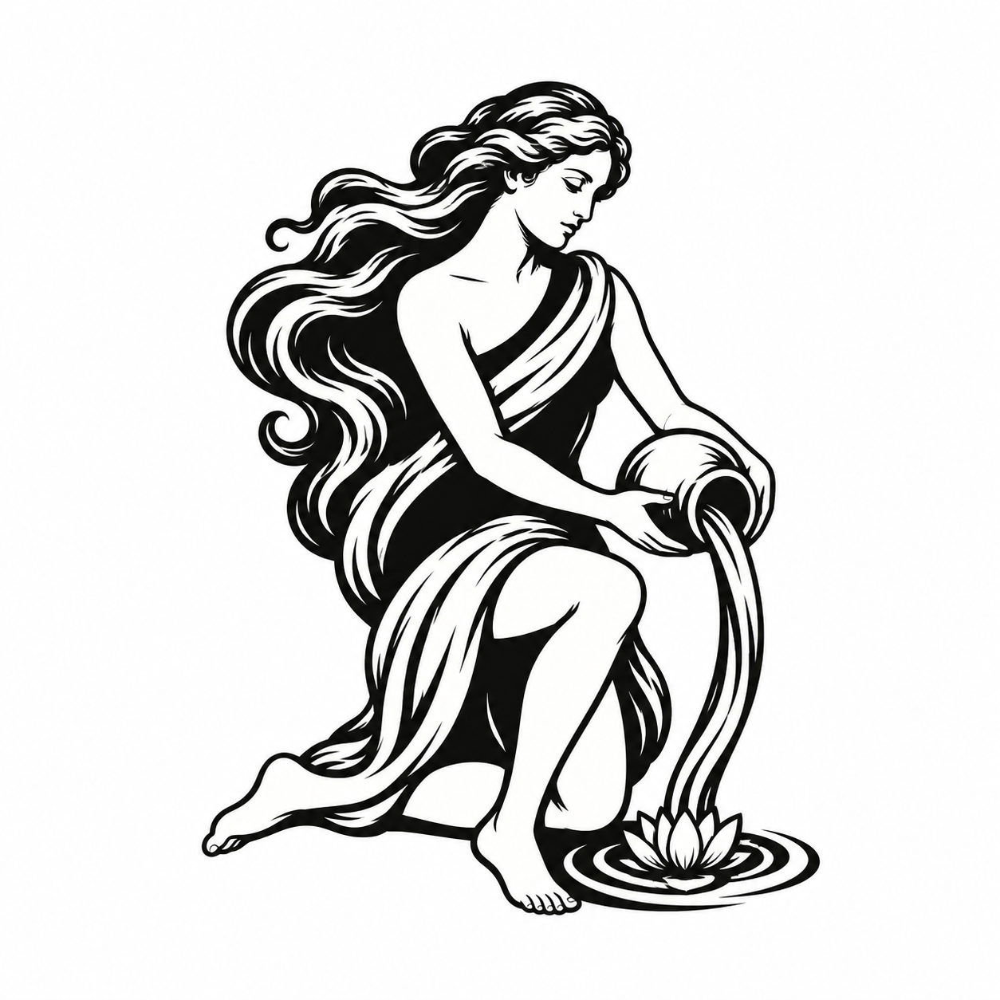
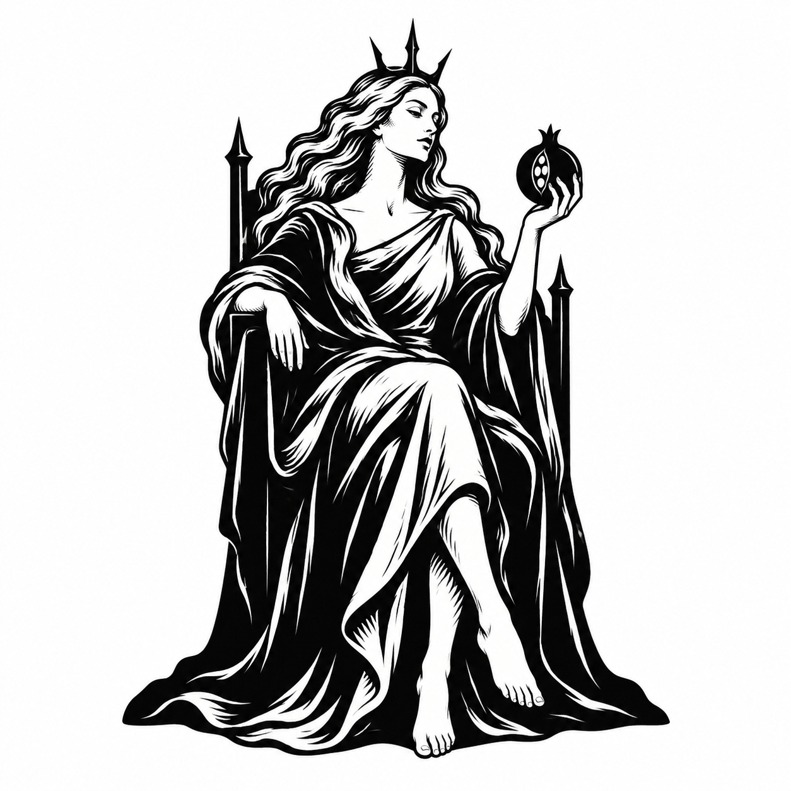

# Akira — full-body black-and-white tarot concepts

The user abandoned the gothic statue direction and requested a return to the original classical woman, without pixel art. These three concepts develop a dark star-masked angel knight, an innocent water bearer with classical drapery and no visible intimate details, and a foreboding Empress. They were generated using built-in image_gen after the earlier image quota reset.

The user subsequently liked all three, especially the knight. All three original PNGs are preserved here; no app assets were installed. These are illustrative emblem concepts. Fine engraving and full-body proportions would need further reduction for very small toolbar icons; no actual-size runtime test has been performed.

## The Veiled Knight



Input references:

- `C:/Users/rose4/Documents/protege/docs/branding/akira-circular-tarot-woman-v1.png`
- `C:/Users/rose4/Downloads/Time, Senkai Yami.jpg`
- `C:/Users/rose4/Downloads/Cyberpunk Tarot - The High Priestess.jpg`

Exact prompt:

```text
Use case: logo-brand.
Create ONE original full-body female tarot emblem for Akira. This is a logo exploration: a compact, memorable full-figure silhouette, not a tarot card or an illustration of a whole scene.
Reference 1 is the approved original woman's graceful classical drawing and flowing hair. Use the other supplied cards for pose language, symbolism and graphic ink treatment only; invent the design.
Style: exceptional black-and-white tarot woodcut / engraved emblem. PURE BLACK AND PURE WHITE only, white background, no cream, gray wash or color. Bold flowing outlines, solid black masses and generous clear negative spaces. A few beautifully chosen engraved cuts, not fine lines everywhere. Smooth hand-drawn contours, absolutely NO pixel art.
Square canvas, single centered emblem occupying about 70% of the image height, generous clean margins. Show the COMPLETE figure including feet within a compact composition. Every symbolic detail must belong to her pose or silhouette, not float around as extra decorations. No circular border, detached overhead star, card border, title, label, letters, watermark, scenery or background architecture. Keep it visually convincing as a small icon rather than a complex scene.

DIRECTION 1 — VERY DARK, STRANGE ANGEL KNIGHT.
A full-body adult feminine knight with two close, upward-curving black wings framing her in one compact pointed silhouette. Simplify each wing into a few strong blade-like feather groups with white incisions. Medieval angular armor, articulated shoulders, a long split tabard, armored legs and pointed boots visible below. Her weight shifts subtly onto one leg. Long pale hair drifts behind the armor in two quiet ribbons.
Her most important feature is an uncanny BLACK STAR-SHAPED MASK covering her eyes and upper face: an irregular eight-rayed black sun, with long needle-like side rays, concealing all eyes. A small pale mouth and chin remain below it. The star is literally her mask, attached to her face, never a star floating overhead. It should feel blind, solemn, alien and inexplicably aware. The mask must remain readable.
She holds a single tilted hourglass diagonally across her body in both gauntleted hands, as if slowly turning time. A thin white line in its black glass suggests the falling sand. No sword or additional objects. Wings, star mask, hourglass and armor are the complete symbolic language.
Dominant black silhouette, white hair and tiny face area as controlled highlights. Ominous, elegant, beautiful and weird. Full body, powerful compact logo mark, not a detailed fantasy character sheet. Preserve a sense of the original woman's poised femininity beneath the new knight imagery.
```

## The Water Bearer



Input references:

- `C:/Users/rose4/Documents/protege/docs/branding/akira-circular-tarot-woman-v1.png`
- `C:/Users/rose4/Downloads/Tarot_ The Star.jpg`
- `C:/Users/rose4/Downloads/𖤐 The World - Tarot Cards.jpg`

Exact prompt:

```text
Use case: logo-brand.
Create ONE original full-body female tarot emblem for Akira. This is a logo exploration: a compact, memorable full-figure silhouette, not a tarot card or an illustration of a whole scene.
Reference 1 is the approved original woman's graceful classical drawing and flowing hair. Use the other supplied cards for pose language, symbolism and graphic ink treatment only; invent the design.
Style: exceptional black-and-white tarot woodcut / engraved emblem. PURE BLACK AND PURE WHITE only, white background, no cream, gray wash or color. Bold flowing outlines, solid black masses and generous clear negative spaces. A few beautifully chosen engraved cuts, not fine lines everywhere. Smooth hand-drawn contours, absolutely NO pixel art.
Square canvas, single centered emblem occupying about 70% of the image height, generous clean margins. Show the COMPLETE figure including feet within a compact composition. Every symbolic detail must belong to her pose or silhouette, not float around as extra decorations. No circular border, detached overhead star, card border, title, label, letters, watermark, scenery or background architecture. Keep it visually convincing as a small icon rather than a complex scene.

DIRECTION 2 — GRACEFUL, INNOCENT CLASSICAL FIGURE.
An unmistakably ADULT woman, shown full body in a graceful kneeling pose in three-quarter profile, quietly pouring one small rounded jug of water with both hands. One knee rests low, the opposite bare foot reaches gently forward. Long flowing hair makes one generous S-curve behind her back and wraps toward her hip, gathering the whole composition into a compact silhouette. Her head inclines gently toward the water with a serene expression.
Keep the suggestion of a classical unclothed tarot figure WITHOUT visible nudity: render her torso and pelvis as smooth uninterrupted solid-black silhouette, no internal anatomy, no nipple or genital details. A broad flowing sash and her hair cross chest and hips for clear coverage. Bare arms, legs and the graceful outline carry the classical feeling. This is innocent allegorical art, no erotic pose or emphasis.
The poured water forms one elegant white-on-black descending ribbon, ending in a single shallow crescent-shaped ripple beneath her knee and foot. One small water lily opens at the end of that ripple, integrated with the base of the emblem. Do not draw a pond or landscape. Water, lily and caring gesture are her only symbols.
Airy, tender and quietly joyful. Use broad serene curves and abundant white openings to feel lighter than the dark knight. The silhouette should be recognizable as the woman pouring water when small; preserve beautiful pose anatomy and make every hand/arm/leg clearly readable. No wings, mask, stars, wreath or frame.
```

## The Empress



Input references:

- `C:/Users/rose4/Documents/protege/docs/branding/akira-circular-tarot-woman-v1.png`
- `C:/Users/rose4/Downloads/download (1).jpg`
- `C:/Users/rose4/Downloads/Cyberpunk Tarot - The Empress.jpg`

Exact prompt:

```text
Use case: logo-brand.
Create ONE original full-body female tarot emblem for Akira. This is a logo exploration: a compact, memorable full-figure silhouette, not a tarot card or an illustration of a whole scene.
Reference 1 is the approved original woman's graceful classical drawing and flowing hair. Use the other supplied cards for pose language, symbolism and graphic ink treatment only; invent the design.
Style: exceptional black-and-white tarot woodcut / engraved emblem. PURE BLACK AND PURE WHITE only, white background, no cream, gray wash or color. Bold flowing outlines, solid black masses and generous clear negative spaces. A few beautifully chosen engraved cuts, not fine lines everywhere. Smooth hand-drawn contours, absolutely NO pixel art.
Square canvas, single centered emblem occupying about 70% of the image height, generous clean margins. Show the COMPLETE figure including feet within a compact composition. Every symbolic detail must belong to her pose or silhouette, not float around as extra decorations. No circular border, detached overhead star, card border, title, label, letters, watermark, scenery or background architecture. Keep it visually convincing as a small icon rather than a complex scene.

DIRECTION 3 — FOREBODING, ELEGANT EMPRESS.
An adult woman shown FULL BODY seated in three-quarter view on a narrow, tall throne. Regal long white hair, serene classical profile looking slightly down toward the viewer, and a stark crown with three slender thorn-like points. She is beautiful, restrained and quietly intimidating. A long black mantle and sculptural robe descend in two grand folds; her crossed lower legs and one elegantly extended foot remain readable at the bottom. Show the entire seated figure and feet, not a cropped bust.
One hand rests on the throne arm, the other lightly raises a single dark pomegranate, split just enough to reveal three white seed shapes. Her pose feels effortless and commanding. The throne's two tall angular sides suggest thorns without adding actual vines or decorative carving. Its dark lower base merges naturally into the drapery so the whole design reads as one compact silhouette.
Crown, pomegranate, throne and flowing mantle express sovereignty, knowledge and danger. No extra scepters, weapons, skulls, surrounding plants, floating symbols or scene. The image should feel full of implication, not filled with tiny things.
Bold black robe and throne, white face/hair/hand highlights, a few carved lines controlling volume. Refined classical tarot, dark elegance and ominous stillness. This must be an iconic emblem with an excellent silhouette, not a detailed illustrated tarot card.
```

