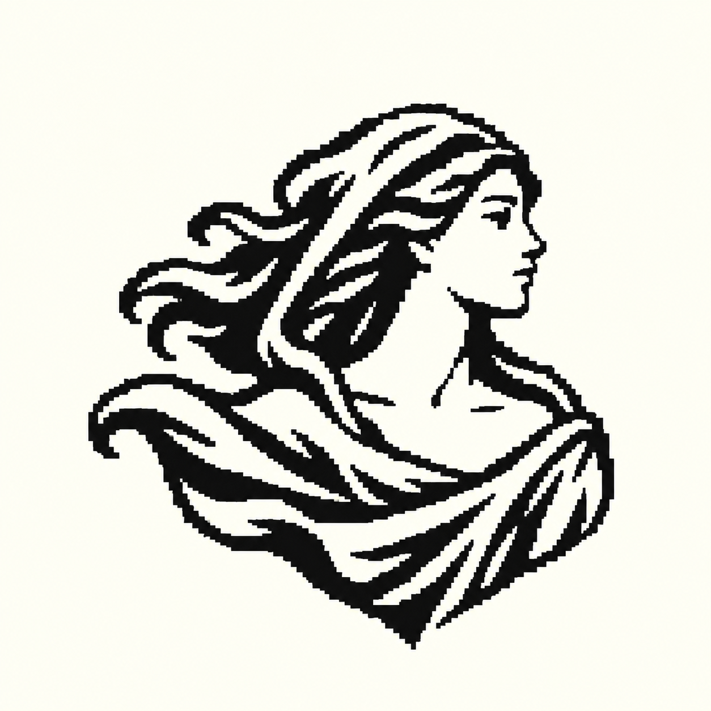
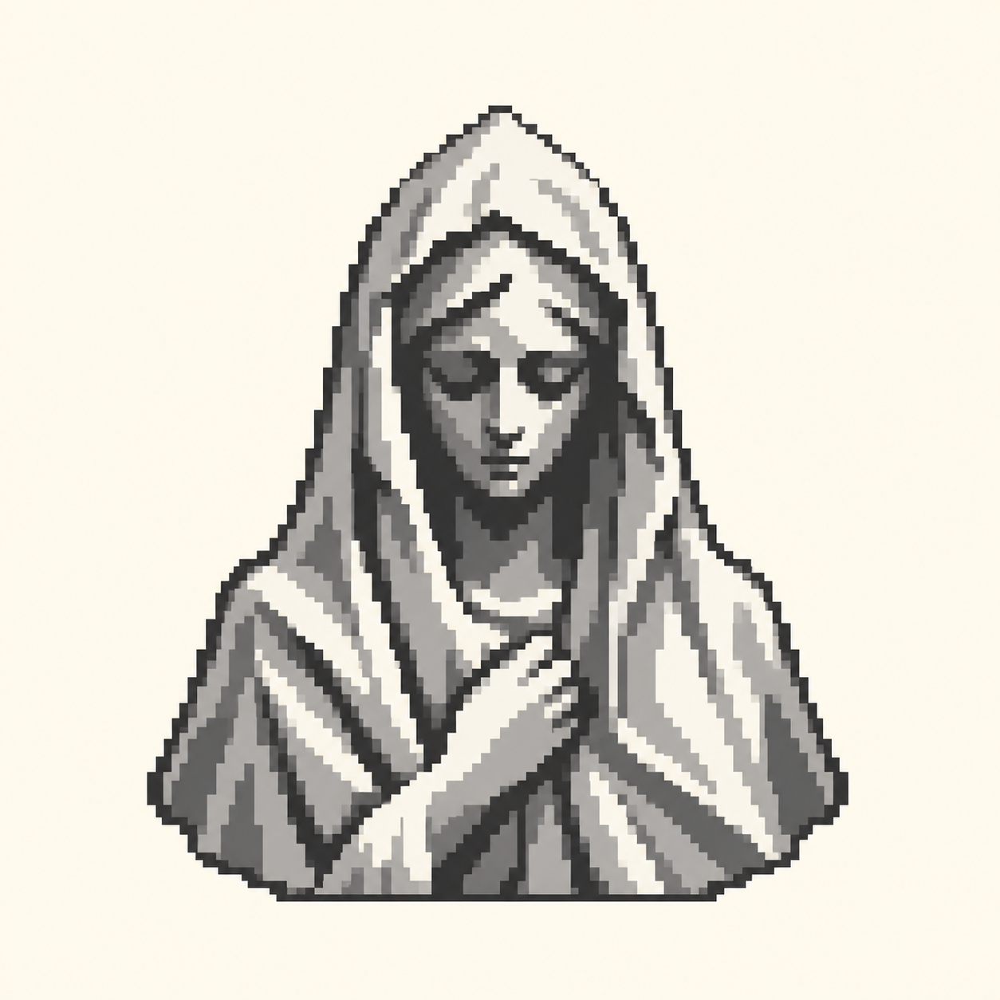

# Akira — nomad and gothic statue pixel logos

## Current user direction

The user selected pixel art but felt the circular woman plus star resembled Starbucks. The next two requested logo concepts remove the circle and star: a female explorer/nomad in a cloak with classical tarot drapery, and a gothic statue aesthetic inspired by the supplied stone-figure photograph. Each is a compact freestanding bust logo. No earlier drafts were replaced.

Generated with built-in image_gen. The nomad uses the approved pixel woman as an identity/style reference. The gothic image uses the supplied photograph only as a material and mood reference, with an original pose and silhouette.

## The Nomad



Input references:

- `C:/Users/rose4/Documents/protege/docs/branding/akira-tarot-woman-pixel-v1.png`

Exact prompt:

```text
Use case: logo-brand.
Create ONE compact PIXEL ART logo for Akira, developing the woman in the supplied reference into an explorer / wandering nomad. The reference is the identity and pixel-style starting point. REMOVE the circle and star completely.
Keep her recognizable serene adult feminine profile facing right, now gazing outward with quiet curiosity. Show only head, shoulders and upper torso. A practical wind-swept cloak with a loose hood is her only garment: drape it naturally across her chest for coverage, leaving her neck, collarbone and one shoulder bare in a classical tarot manner. No shirt, armor or extra clothing beneath the cloak. Tasteful classical figure, not sexualized. Some flowing hair escapes the hood and sweeps left; reduce it to a few bold locks. The cloak makes one broad leftward wind-swept sweep and a compact taper below. No staff, weapon, backpack or other prop. The loose hood, outward gaze, and wind-shaped cloak should immediately suggest a traveler.
This must be a DISTINCTIVE FREESTANDING LOGO, not a scene or full-body character illustration. Use a strong asymmetric silhouette and a few confident negative-space cuts. Beautiful hand-placed pixel-art contour decisions on an approximately 80-by-80 logical grid, enlarged as crisp square pixels. Two flat colors only: ink black and warm ivory. Broad coherent pixel clusters, consistent pixel size, restrained facial features and just a few cloak folds. No engraving, hatching, tiny speckles, dithering, antialiasing or blurred pixel filter.
Square uniform warm-ivory canvas. Centered single logo approximately 60% of the canvas width with even generous margins. The outer edge must be formed by the woman and cloak alone. NO circle, ring, star, halo, crest, shield, frame, lettering, labels, background scenery or decorative symbols. Preserve the grace of the approved woman while inventing the new nomadic silhouette.
```

## The Stone Keeper



Input references:

- `C:/Users/rose4/AppData/Local/Temp/codex-clipboard-06d016d8-4403-413c-a3f2-41572c1f3b10.png`

Exact prompt:

```text
Use case: logo-brand.
Create ONE compact PIXEL ART logo with the aesthetic of an old gothic stone statue. The supplied photo is a mood/material reference ONLY: its veiled stone face, bowed head, quiet gravity, and deeply carved drapery. Invent an original sculpture-emblem; do not reproduce the photograph, surroundings, watermarks or exact figure.
A frontal adult feminine stone bust with a subtly bowed head and heavy angular veil. Serene downcast eyes recessed into shadow, a refined pale stone face. One small simplified stone hand rests at her sternum holding the veil edge. Restrained monumental cloak folds taper into a short broad base that belongs to the bust, with no pedestal. Her veil creates a distinctive compact peaked arch-like silhouette by itself; no separate architectural arch or enclosure. Quiet, mysterious and gothic; not a zombie or a detailed game character. No overt religious symbols needed.
It MUST read as a small standalone LOGO. Reduce the statue to strong sculptural pixel clusters, two or three major drapery folds and very limited chiseled shading. Use four flat tones: charcoal, cool slate gray, pale stone gray and ivory. Genuine crisp pixel art on an approximately 80-by-80 logical grid shown enlarged; consistent square pixels, clean stair-step contours, restrained face detail, broad shadow masses. No photorealistic texture, engraving, dithering, little cracks everywhere, gradients or antialiased smoothing.
One centered freestanding logo about 60% of a square canvas, uniform warm-ivory background and generous empty margins. No circle, ring, star, halo, wings, cross, shield, ornamental frame, lettering, labels, scene or additional objects. The silhouette and small carved face should carry the entire identity.
```

## Notes for Claude

- Pixel art is the chosen medium. The circle-and-star composition is superseded for these new concepts.
- Both outputs were visually inspected for the requested subject, pixel treatment, compact outline, and absence of the circle and star. The nomad keeps the right-facing profile and wind-swept cloak; the statue uses a frontal veiled stone figure with one hand holding its drapery.
- The user has not chosen between the two new concepts. All earlier images remain untouched.
- These are enlarged PNG logo studies with ivory presentation backgrounds. Final native-grid construction, transparent exports, and actual-size UI checks remain part of production after selection.
- No runtime UI, backend, package labels or installed application icons changed in this concept pass.

