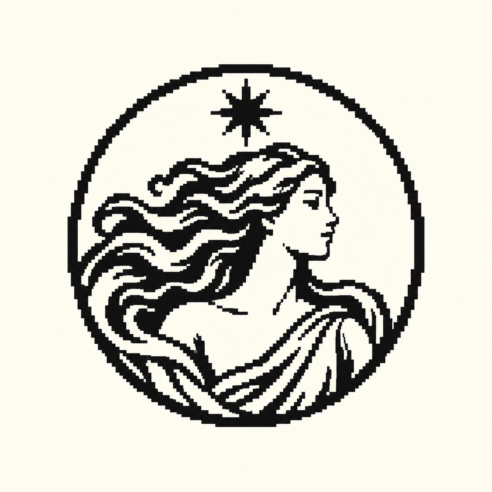
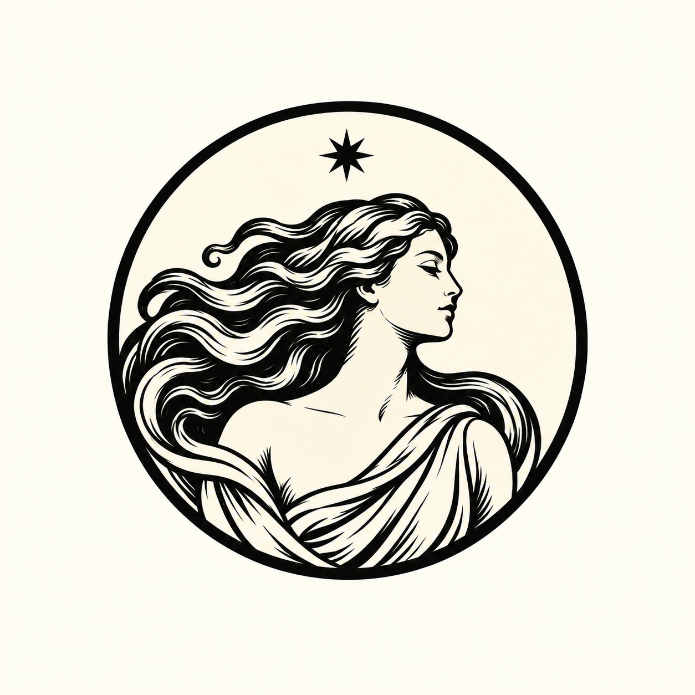
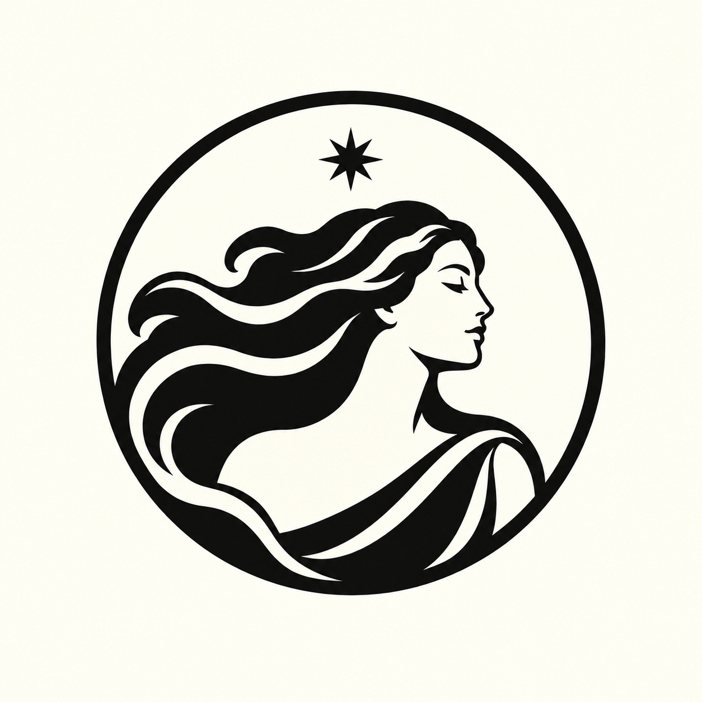

# Akira — tarot woman iterations

The user selected the circular classical woman as the logo direction and requested three considered stylistic iterations while retaining the original draft: pixel art, a more refined tarot treatment without added clutter, and minimalism.

Generated using built-in image_gen. The original is preserved as `akira-circular-tarot-woman-v1.png` and its SHA-256 was checked against the original generated image. All three outputs are separate PNG concept assets. No application branding was installed in this pass.

## Preserved original


## Three iterations

### Pixel art



Exact initial prompt:

```text
Use case: logo-brand.
Asset: one carefully resolved small circular Akira logo, a stylistic iteration of the supplied approved draft. The input is the edit target and identity reference.
PRESERVE: recognizable adult woman's serene right-facing classical profile, long hair flowing toward the left, draped shoulder, one eight-pointed star above her, and a circular outer silhouette. Retain her facial character and the black-on-ivory identity. Preserve the intimacy and grace of the original. Keep the design compact and readable as an application logo.
Composition: one circular emblem centered on a square uniform warm-ivory canvas, emblem diameter about 65% of image width, ample even margins. Improve optical balance. Give the star clear breathing room above the hair and below the ring; its tips must not collide with either. Keep the nose comfortably inside the circle. No lettering, names, labels, tarot card, extra emblems, mockups, gradients, shadows, scenery, or additional stars.

STYLE: masterfully hand-placed PIXEL ART reinterpretation. Redraw the complete woman, hair, star and circular border as a coherent approximately 96-by-96-pixel emblem, shown enlarged with sharp nearest-neighbor square pixels. It must visibly read as genuine pixel art, not a high-resolution engraving with a pixel filter.
Use exactly two flat colors: ink black and warm ivory. Build confident pixel clusters: a few flowing hair ribbons and broad folds of the garment, a beautiful readable forehead-nose-lips-chin profile, tiny restrained eye, beautifully stepped circle and star. Consistent logical pixel size across the artwork, deliberate stair steps and clean curves. Make smart simplifications so the portrait remains graceful at native small size. No thin scratchy lines, dithering, texture, grain, blur, anti-aliasing, tiny stray pixels, or mixed pixel sizes. Keep the strong sweeping motion of her hair without preserving every strand from the reference. The artistic effort should be visible in the excellent contour decisions and elegant cluster design.
```

Input image (edit target and identity reference): `C:/Users/rose4/Documents/protege/docs/branding/akira-circular-tarot-woman-v1.png`.

### Refined tarot



Exact initial prompt:

```text
Use case: logo-brand.
Asset: one carefully resolved small circular Akira logo, a stylistic iteration of the supplied approved draft. The input is the edit target and identity reference.
PRESERVE: recognizable adult woman's serene right-facing classical profile, long hair flowing toward the left, draped shoulder, one eight-pointed star above her, and a circular outer silhouette. Retain her facial character and the black-on-ivory identity. Preserve the intimacy and grace of the original. Keep the design compact and readable as an application logo.
Composition: one circular emblem centered on a square uniform warm-ivory canvas, emblem diameter about 65% of image width, ample even margins. Improve optical balance. Give the star clear breathing room above the hair and below the ring; its tips must not collide with either. Keep the nose comfortably inside the circle. No lettering, names, labels, tarot card, extra emblems, mockups, gradients, shadows, scenery, or additional stars.

STYLE: an exceptionally refined classical tarot wood engraving emblem. Elevate the original through graceful drawing, controlled black shapes, lucid negative space, and intentional line hierarchy—not extra ornament. One restrained black outer ring. Keep the face open and calm, with a beautifully proportioned profile, delicate closed eye, composed lips and clean neck contour.
Organize the long flowing hair into four or five sculptural waves with generous ivory separations, following the original movement. A few confident engraving cuts inside these major shapes should describe their volume. Shape the cloth into two or three elegant folds meeting the bottom of the medallion. Reserve fine hatching for a few deep shadows only; leave skin and background quiet. The single sharp star is meticulously drawn and separated from hair and border by clear air.
Two-color ink black and pale parchment. Ink edges may have extremely subtle hand-cut character, but no all-over distress, speckle or decorative filigree. Flat even ivory background. Think of a superbly carved miniature seal designed by an expert illustrator, not a busy tarot painting. Preserve warmth and femininity while making the silhouette and linework more confident than the input.
```

Input image (edit target and identity reference): `C:/Users/rose4/Documents/protege/docs/branding/akira-circular-tarot-woman-v1.png`.

### Minimal



Exact initial prompt:

```text
Use case: logo-brand.
Asset: one carefully resolved small circular Akira logo, a stylistic iteration of the supplied approved draft. The input is the edit target and identity reference.
PRESERVE: recognizable adult woman's serene right-facing classical profile, long hair flowing toward the left, draped shoulder, one eight-pointed star above her, and a circular outer silhouette. Retain her facial character and the black-on-ivory identity. Preserve the intimacy and grace of the original. Keep the design compact and readable as an application logo.
Composition: one circular emblem centered on a square uniform warm-ivory canvas, emblem diameter about 65% of image width, ample even margins. Improve optical balance. Give the star clear breathing room above the hair and below the ring; its tips must not collide with either. Keep the nose comfortably inside the circle. No lettering, names, labels, tarot card, extra emblems, mockups, gradients, shadows, scenery, or additional stars.

STYLE: a beautifully reduced contemporary emblem, precise and quiet, with flat crisp vector-like contours. This is a substantial simplification of the approved portrait while keeping her recognizable, not a different generic female icon.
Resolve her into a bold flowing black hair silhouette, one smooth ivory face-and-neck negative space with the same serene right-facing profile, and two broad curved ivory cuts that suggest the moving hair. One restrained short closed-eye mark; rely on the outer profile to describe nose, lips and chin. Reduce the draped shoulder to one elegant diagonal curve. Avoid interior strand lines and engraving entirely.
One clean circular boundary enclosing the lower hair/shoulder, with the single eight-pointed star freely suspended above the head. Strong distinction between filled shapes and surrounding negative space, balanced visual weight and graceful curve rhythm. Ink black and uniform warm ivory only, no texture whatsoever. Keep enough open space that it can function at 32–48 pixels. Excellent custom mark design, simple without losing the classical woman's character. No monograms, abstract letters, beauty-salon flourishes or additional framing.
```

Input image (edit target and identity reference): `C:/Users/rose4/Documents/protege/docs/branding/akira-circular-tarot-woman-v1.png`.

## Final spacing refinement

Visual review found that the engraved and minimal variants still connected the star to the hair. Both received this targeted edit. The saved final PNGs above include the correction; the pixel variant uses its initial result.

```text
Use case: precise-object-edit.
Make ONE tiny final polish to this approved circular logo image: reduce the black eight-pointed star to 65% of its current height and width, keeping its center at the same position. It must float freely in ivory space, with a clearly visible gap between its bottom tip and the woman's hair, and another gap between its top tip and the circular border.
Preserve EVERYTHING else exactly: the woman's face, hair, garment, all linework, circle, image dimensions, framing, ivory and black colors, background. Do not redraw, simplify or embellish the portrait. No new elements or text. Only shrink the star. This spacing correction is essential for the small logo.
```

Edit inputs:

- Refined tarot — final: `C:/Users/rose4/.codex/generated_images/01a08c1c-ca84-7720-8981-89156fd0a7ea/exec-f44d44fc-e714-4b41-a963-07a3505f4847.png`
- Minimal — final: `C:/Users/rose4/.codex/generated_images/01a08c1c-ca84-7720-8981-89156fd0a7ea/exec-5d1e7649-f02e-4cc4-a5e8-9ffdecaf8647.png`

## Review notes for Claude

The right-facing woman, flowing hair, single eight-pointed star, and circular silhouette are the selected identity direction. Earlier skull, egg, and other explorations remain for history. The exact final treatment remains the user's choice. All three new variants were visually inspected for composition, face, silhouette, style differences, and star placement. The pixel image is a generated pixel-art study rather than a certified native-grid source. These enlarged PNGs retain the ivory presentation background; final transparent, vector or native-grid app assets and checks at actual UI sizes belong to the implementation stage after selection.

